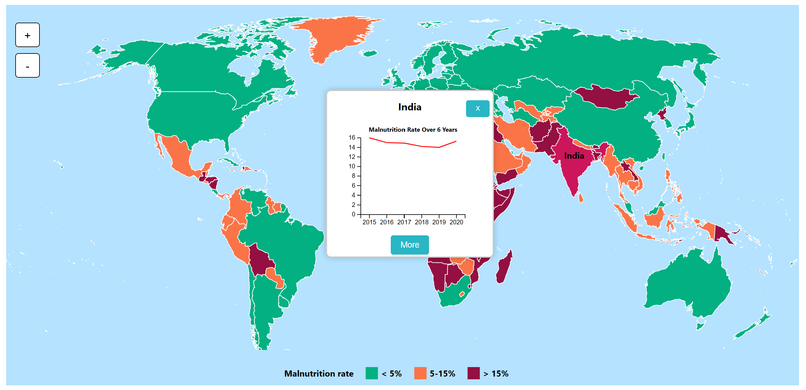
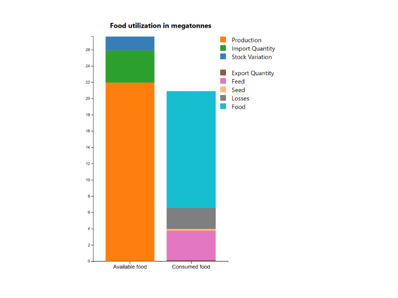
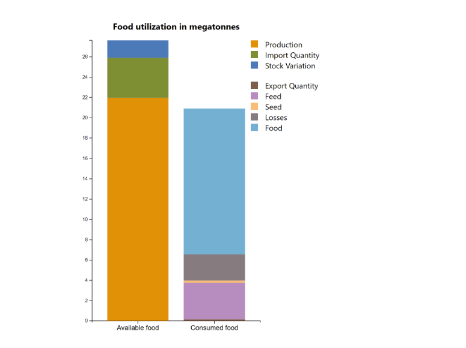
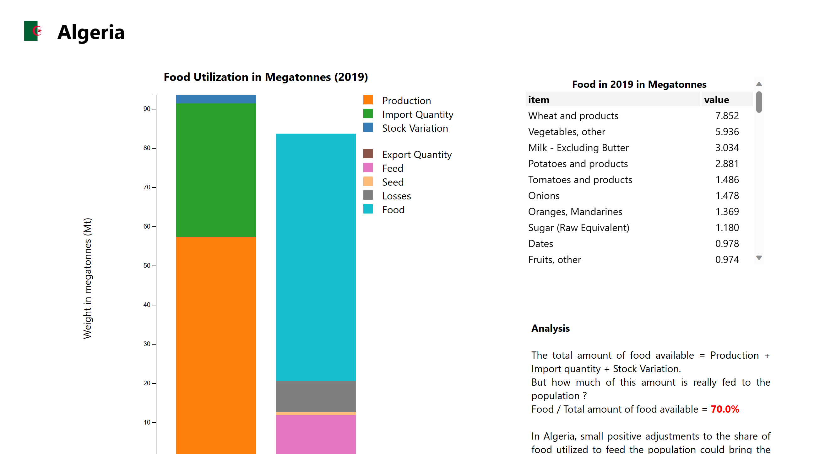
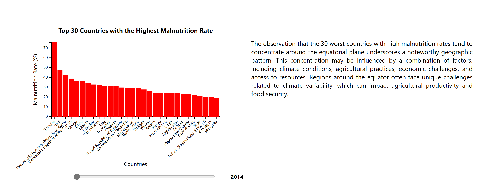
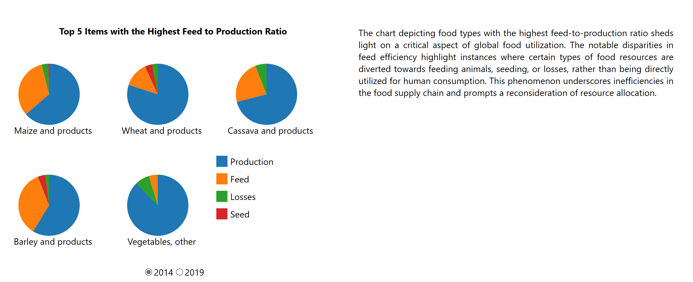

# VI_Project

- Membres: Maillefer Dalia, Vervelle Killian
- Public cible: Grand public
- Intention/objectif: Démontrer que la crise mondiale alimentaire n'est pas une question de productivité mais bien de répartition
- Source(s) de données: https://www.fao.org/gift-individual-food-consumption/data/en
- Descriptif du projet: Visualisation des données au moyen d'une page HTML
- Lien du projet: https://github.com/AliceThunderWind/VI_Project
- Date de présentation souhaitée: TBD


## Architecture, Frameworks and Technologies

This project contains a backend and a frontend, in other words our website. For our backend, we used FastAPI as framework and its goal is to get all data from CSVs and send them to the frontend in a JSON format.

As for the frontend, we created from scratch a website using the framework React and JavaScript as language. With this, we were able to use the library D3.js, well-known for creating charts and visualization.

Finally, in order to have cleaned data and ready to be used, we have worked with Python Notebook.

## Documentation

### Choice of data

The data utilized in this project has been sourced from the Food and Agriculture Organization of the United Nations (FAO). The comprehensive dataset includes diverse information, encompassing:

- Undernourishment rates for all countries over a five-year period.
- Population figures for each country in 2014 and 2019.
- Total food supply per country and per item, measured in 1000 tonnes, for the years 2014 and 2019.
- The count of undernourished individuals per country in 2014 and 2019.
- Components of the food balance for each country in 2014 and 2019, covering aspects such as production, feed, and food. 

Additionally, we have augmented the dataset by incorporating:

- list of ISO2/3 indices associated with countries.
- Total food supply per country and per item, measured in kilocalories (kcal), for the years 2014 and 2019.
- The average calorie intake per day per person per country

### Purpose, Communication, Target Audience

Our objective is to convey to the broader public that the worldwide food crisis stems not from inadequate productivity but rather from an imbalance in the equitable distribution of food globally. Through our application, we aim to unravel the intricate dynamics of the equation's elements (**Domestic supply quantity = Production qty + Imports + Opening stock - Exports - Closing stock - Food - Feed - Seed - Losses - Processed - Others uses - Tourist consumption - Residuals**), shedding light on the underlying factors. Our ultimate goal is to pinpoint opportunities and areas for intervention that can significantly reduce malnutrition.

This message is tailored for a diverse audience, including but not limited to policymakers, researchers, and individuals concerned about global food issues. By providing a nuanced understanding of the root causes and potential solutions, we strive to empower a wide range of stakeholders to contribute to a more balanced and sustainable global food system.

### Representation, Presentation and interaction

#### General

Throughout the entire website, we have maintained a consistent typographical style to ensure textual coherence during navigation. Additionally, font weight, particularly bold text, has been strategically employed to emphasize titles and convey crucial information.

#### World map

Given our focus on addressing global malnutrition issues, the utilization of a world map is pivotal for providing an overview of malnutrition rates worldwide. To achieve this, we employed D3.js to generate the map using data from a JSON file located in the /assets folder, outlining each country's borders. Our choice to use D3.js stems from a deliberate decision to avoid libraries like Leaflet, which include extraneous details such as city names and roads, ultimately overloading our map with unnecessary information. Our commitment to simplicity enables users to zoom in/out using buttons or mouse scroll, drag the map, and select a country—a design inspired by Ben Shneiderman's principles of overview, zoom, and details-on-demand.

While users may recognize some countries, others may be unfamiliar. To address this, we incorporated a dropdown menu alphabetically listing all countries. Whether a user selects a country on the map or through the dropdown menu, the result remains consistent—a popup at the map's center displaying detailed malnutrition rate information over the years.


In terms of user interaction, hovering over a country lightens its color, visually indicating the selected country under the mouse. Simultaneously, the country's name is displayed at the center.


Clicking on a country reveals a popup with a line chart depicting malnutrition rates over a 6-year period. For users desiring more detailed information, clicking the "More" button (with a hover effect darkening the color) redirects them to another page.



Careful consideration was given to the color scheme, utilizing a limited but meaningful palette. Three colors—green, orange, and red—were chosen, each conveying significance within our cultural context. Green symbolizes positivity, representing areas with favorable nutritional conditions; orange serves as a cautionary hue for regions with moderate malnutrition levels, while red is reserved for areas requiring urgent attention due to high malnutrition rates.

#### Details about a country

For the country-specific details page, we've employed a grouped bar chart to present our data effectively.


A significant improvement is the careful consideration of the data ink ratio. We refined the y-axis unit to megatonnes, eliminating excessive zeros in the scaling. Borders were removed, providing a cleaner aesthetic. To enhance clarity, we introduced spacing between categories, guiding users to associate top legend categories with the left bar and bottom legend categories with the right bar.

To cater to color-blind individuals, we meticulously selected a color palette, verified using the Colblindor website. [Colblindor](https://www.color-blindness.com/coblis-color-blindness-simulator/)

Normal view :



Red-weak/Protanomaly :



User guidance is integrated, prompting them to click on any category in the stacked chart. Hover effects highlight the selected category, displaying its name and value. A detailed table appears on the right, providing itemized information within the chosen category.



An additional analysis in the bottom-right corner illustrates the ratio of food fed to the population compared to the total available food.

#### World overview with charts

The final page of our website is dedicated to global hunger facts and statistics. Each chart is accompanied by complementary analysis on the right, enriching the user's understanding.

In all charts, we ensure a non-biased interpretation by starting the y-axis with zero. The first graph depicts the evolution of average daily calorie intake over five years, presented through a line chart. Calculated values consider the sum of food supply kcal for 2014 and 2019, divided by the population, and further divided by 365 days.


The second graph identifies the top 30 countries with the highest malnutrition rates, illustrated in a bar chart.



When it comes to showing data over time, we came with the idea to use a slider and let the user interact with our chart and choose a specific year. When selecting a year, charts will update data accordingly to the chosen year.

Finally, in our last graph, we chose to show the top 5 of item with the highest feed to production ratio. We opted for a rounded-form chart over rectangular one with the goal of diversify our graphs.



The user can also interact with the chart by clicking a radio button. We chose a radio button over a slider because we only have two years of data available (2014 and 2019) and it would be interesting to use a slider with more years.

### Critique of tool(s) used

Using the library D3.js for the first was a bit difficult, especially for our specific needs. For instance, when we wanted to display a label below the graph, either the text was cropped or invisible. We had to figure out how to make the text visible with margin, padding, resizing the graph, etc.

## Installation

### Run with Docker

A `docker-compose.yaml` is located at the root of the repository. With the two commands below, you will be able to run our application and API :

```bash
docker compose build
docker compose up -d
```

Then, head over to [http://localhost:3000](http://localhost:3000) and you will be able to navigate in our website.

### Run without Docker

If you wish to run without Docker, you can run the two applications but make sure you have the version 18 for Node and Python 3.9.

For running the backend, you will need to install librairies. You may choose to use a venv (with Conda) if you want. From the folder `src/`, run the following command :

```bash
pip install -r requirements.txt
uvicorn main:app --reload
```

As for the frontend, you will also need to install dependencies from the package.json. Use the commands below to install and run the application :

```bash
npm install
npm start
```

If everything is running properly, you should be able to have our home page ([http://localhost:3000](http://localhost:3000)) and data displayed from the API (Swagger available in [http://localhost:8000/docs](http://localhost:8000/docs))