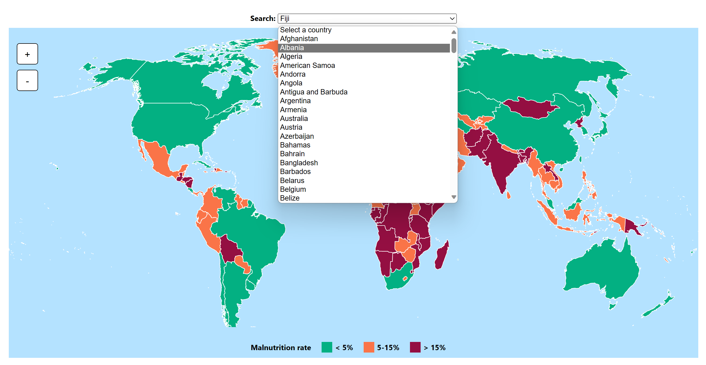
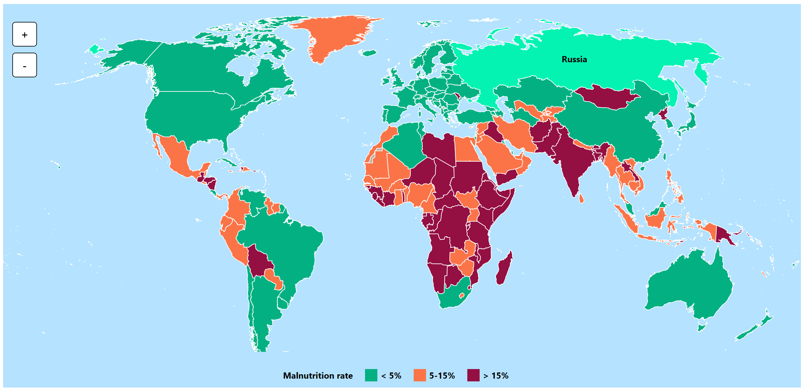
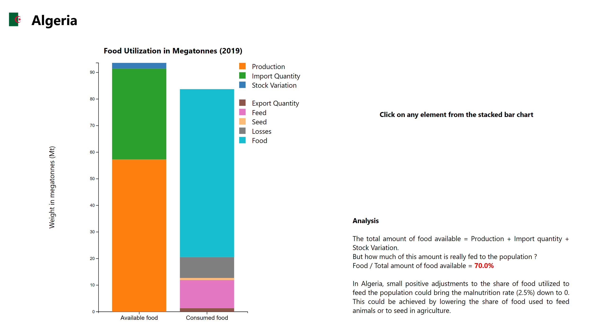

# VI_Project

- Membres: Maillefer Dalia, Vervelle Killian
- Public cible: Grand public
- Intention/objectif: Démontrer que la crise mondiale alimentaire n'est pas une question de productivité mais bien de répartition
- Source(s) de données: https://www.fao.org/gift-individual-food-consumption/data/en
- Descriptif du projet: Visualisation des données au moyen d'une page HTML
- Lien du projet: https://github.com/AliceThunderWind/VI_Project
- Date de présentation souhaitée: TBD


## Architecture, Frameworks and Technologies

This project contains a backend and a frontend, in other words our website. For our backend, we used FastAPI as framework and its goal is to get all data from CSVs and send them to the frontend in a JSON format.

As for the frontend, we created from scratch a website using the framework React and JavaScript as language. With this, we were able to use the library D3.js, well-known for creating charts and visualization.

Finally, in order to have cleaned data and ready to be used, we have worked with Python Notebook.

## Documentation

### Choice of data

The data we used during this project comes from the website of the Food and Agriculture Organization on the United Nations ([FAO](https://www.fao.org/gift-individual-food-consumption/data/en)).

We can find information such as :

- Name of the country
- // TODO

With that, we also added/created more information like :

- ISO2/3
- KCal


### Intention, message, audience

We would like to demonstrate to the general public that the global food crisis is not a question about productivity but of distribution. With our application, we would be able to understand the complex interaction of the element in the equation (**Domestic supply quantity = Production qty + Imports + Opening stock - Exports - Closing stock - Food - Feed - Seed - Losses -+ Processed - Others uses - Tourist consumption - Residuals**), identify underlying causes and define opportunities/areas of intervention.

### Representation, Presentation and interaction

#### General

In the whole website, we used only one typography in order to have consistency in the text while navigating. We also used font weight (bold text) to emphasize title or important information.

#### World map

Because we are interested in the malnutrition in the world, it is natural to work with a map of the world in order to have an overview of the malnutrition rate. We used D3.js to create the map (from a JSON file in the `/assets` folder) and draw a country by its border. Since we're interested in the country, we didn't use another library  like Leaflet because their maps also display city names, roads, etc. These are useless information, will not add anything to the analysis and therefore will overload our map. We decided to keep it simple. The user can zoom in and out using either buttons on the left or the mouse (scroll), drag the map and select a country. This is following a few recommendation from Ben Shneiderman such as overview, zoom and details-on-demand.

We may recognize some countries and know its location on the map. But sometimes, we don't. Therefore, we also added a dropdown menu containing the list of all countries sorted alphabetically. Even if we select a country on the map or on the dropdown menu, the result will still be the same, which is displaying a popup in the center of the map, showing more details about malnutrition rate over the year.



As for the interaction, when the user is hovering a country, we made the color a bit lighter to show the selected country under the mouse. We also displayed the name of the country in the center of the latter.



The user can then click on the country and a popup will be displayed with a line chart of the malnutrition rate over a period of 6 years. If the user is interested by knowing more information about the selected country, he can click on the "More" button (also with a hover effect, darken the color) and he will be brought to another page


Regarding the color used, we made sure to use few colors and also meaningful ones. For instance, in our map, we used 3 colors (green, orange and red) that are meaningful in our culture. Indeed, green  represents something positive and signifies areas with favorable nutritional conditions, while orange serves as a cautionary color, indicating regions with moderate levels of malnutrition. Red is reserved for areas with a high malnutrition rate, emphasizing critical zones that demand urgent attention.

#### Details about a country

For the page of details about a country, we chose to represent our data using a grouped bar chart.



We have paid particular attention to the notion of data ink ratio. Before, in the y-axis, the unit used was the kilogram, leading to values in the scaling with lots of zero (in other words, values in millions). We used to have borders to delimit all grids in the page. Finally, the legend displayed all values below each other, even though, we have two bars with different categories.

The changes we made was to remove all borders, change the unit to megatonnes and we put spaces between [Production, Import Quantity, Stock Variation] and [Export Quantity, Feed, Seed, Losses and Food] with the goal to show to the user that categories in the top of the legend is for the left bar and categories in the bottom is for the right one.

We've also thought about color-blind people by using an appropriate color palette and checked with the website [Colblindor](https://www.color-blindness.com/coblis-color-blindness-simulator/)

Normal view :


Red-weak/Protanomaly :


#### World overview with charts

At the right of each graph, we gave an analysis as complement in order to understand better

When it comes to showing data over time, 

We created a bar chart with the goal to show the top 30 countries


In our "Charts" page, we let the user interact with our charts by choosing a year using a slider (with the choice of selecting one out of 6 years) or using a radio button when data of two years are available (2014 and 2019). When selecting a year, charts will update data accordingly to the chosen year.

We also guide the user

### Critique of tool(s) used

Using the library D3.js for the first was a bit difficult, especially for our specific needs. For instance, when we wanted to display a label below the graph, either the text was cropped or invisible. We had to figure out how to make the text visible with margin, padding, resizing the graph, etc.

## Installation

### Run with Docker

A `docker-compose.yaml` is located at the root of the repository. With the two commands below, you will be able to run our application and API :

```bash
docker compose build
docker compose up -d
```

Then, head over to [http://localhost:3000](http://localhost:3000) and you will be able to navigate in our website.

### Run without Docker

If you wish to run without Docker, you can run the two applications but make sure you have the version 18 for Node and Python 3.9.

For running the backend, you will need to install librairies. You may choose to use a venv (with Conda) if you want. From the folder `src/`, run the following command :

```bash
pip install -r requirements.txt
uvicorn main:app --reload
```

As for the frontend, you will also need to install dependencies from the package.json. Use the commands below to install and run the application :

```bash
npm install
npm start
```

If everything is running properly, you should be able to have our home page ([http://localhost:3000](http://localhost:3000)) and data displayed from the API (Swagger available in [http://localhost:8000/docs](http://localhost:8000/docs))